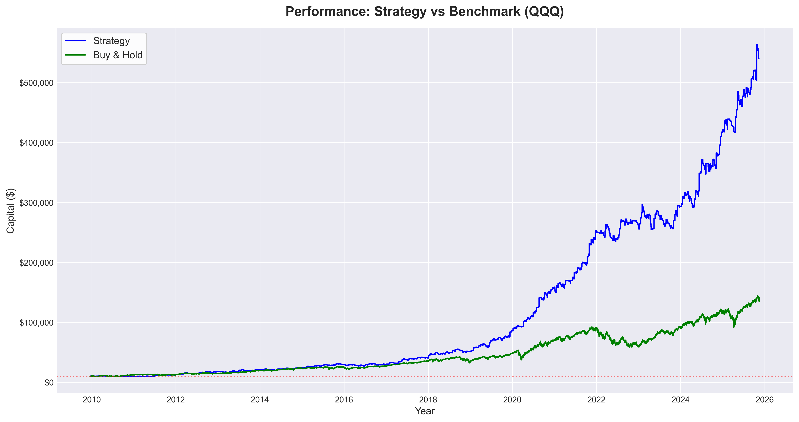

# Python Algo-Trading Suite 🚀


**An algorithmic trading framework designed for the Nasdaq-100 (QQQ). It features a custom event-driven backtester, volatility-adjusted risk management, and live execution capabilities via Interactive Brokers API.**

---

## 📈 Performance Overview (Backtest 2009-2025)

The strategy focuses on capital efficiency and downside protection. While the Benchmark (QQQ Buy & Hold) suffered a **-35% drawdown**, this engine limited losses to **-14%**, achieving superior risk-adjusted returns.



| Metric             | Strategy      | Benchmark (QQQ) | Note                            |
| :----------------- | :------------ | :-------------- | :------------------------------ |
| **Total Return**   | **5,163.42%** | 1,478%          | Significant Alpha generation    |
| **CAGR**           | **28.37%**    | 19.0%           | Compound Annual Growth Rate     |
| **Sharpe Ratio**   | **1.46**      | 0.95            | High return per unit of risk    |
| **Sortino Ratio**  | **3.79**      | 1.34            | Exceptional downside protection |
| **Max Drawdown**   | **-14.28%**   | -35.12%         | robust during bear markets      |
| **Time in Market** | **29%**       | 100%            | Highly capital efficient        |

> _Metrics generated using QuantStats library based on 5-minute OHLC data._

---

## 🧠 Strategy Logic

The engine implements a **Mean Reversion in Trend** philosophy. It seeks to buy short-term oversold conditions but only when the long-term trend is bullish.

### 1. Entry Signal (The "Vortex")

- **Trend Filter:** Price must be above the **SMA 200** (Simple Moving Average). We only trade _with_ the long-term trend.
- **Trigger:** **Williams %R (10-period)** drops below **-80**. This identifies a short-term pullback (oversold) within a bull market.

### 2. Dynamic Risk Management (The "Shield") 🛡️

This is the core of the engine. Position sizing is not fixed but strictly mathematical:

- **ATR-Based Stops:** Stop Loss is calculated dynamically using the **Average True Range (ATR)** multiplied by a factor (e.g., 10x). This adapts the stop distance to market volatility.
- **Fixed Fractional Risk:** Each trade risks exactly **2%** of the current account equity.
- **Volatility Sizing:** If volatility is high (ATR is large), the stop is wider, and the position size (number of shares) automatically decreases to keep the dollar risk constant.

### 3. Exit Mechanism

- **Trailing Stop:** Locks in profits as the price rises, moving the stop level up based on ATR.
- **Trend Reversal:** Emergency exit if the short-term momentum indicator (WillR) recovers while price breaks market structure.

---

## 🛠️ Tech Stack & Architecture

The project is built with a focus on modularity and data analysis.

- **Data Processing:** `Pandas`, `NumPy` (Vectorized operations for speed).
- **Analysis:** `Pandas-TA` (Technical Analysis library), `QuantStats` (Financial metrics).
- **Visualization:** `Matplotlib`, `Seaborn`.
- **Live Execution:** `ib_insync` (Asynchronous wrapper for Interactive Brokers TWS API).

## 🏗️ Project Architecture

The repository is structured to enforce a clean separation between **Data Engineering**, **Research (Backtesting)**, and **Production (Live Trading)**.

```bash
├── backtesting/                # Simulation & Research Engine
│   ├── backtest.py             # Core event-driven backtesting logic
│   ├── backtest.ipynb          # Jupyter Notebook for strategy research & visualization (QuantStats integration)
│   ├── analyze.py              # Custom performance metrics calculation
│   └── heatmap.py              # Visualization utility for monthly return heatmaps
│
├── data/                       # Data Engineering (ETL Pipeline)
│   ├── fetch_data.py           # IBKR API connector to download historical OHLC data
│   ├── calc_data.py            # Feature Engineering (Pre-calculation of ATR, SMA, WillR)
│   ├── check.py                # Data integrity & sanity checks (Timezone, Missing values)
│   └── QQQ_5min.csv            # Processed dataset
│
├── live/                       # Production Trading Environment
│   ├── src/                    # Live execution logic & order management system
│   ├── config.py               # Strategy parameters (RISK_PCT, LEVERAGE, SYMBOLS)
│   ├── .env.test               # Example .env configuration to start live trading
│   ├── requirements.txt        # Project dependencies for live trading
│   ├── logs/                   # Execution logs for audit trails
│
├── output/                     # Performance Artifacts
│   ├── equity_curve.png        # Equity curve visualizations
│   ├── trades_log.csv          # Detailed trade-by-trade execution logs
│   └── stats_strategy.csv      # Computed risk metrics
```
